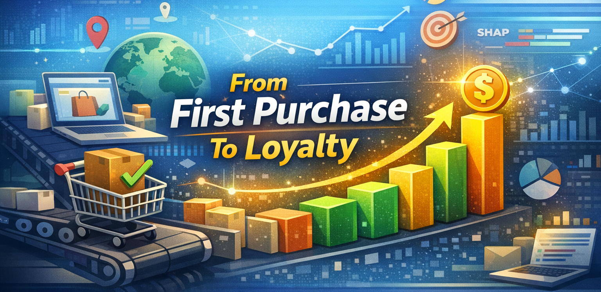

<p align="center">
  
</p>

<h1 align="center">From First Purchase to Loyalty</h1>

<p align="center">
  Olist 이커머스 데이터를 활용한 첫 구매 기반 고객 충성도 예측 & 관문상품(Gateway Product) 분석 플랫폼
</p>

[](https://olist-dashboard-xqwt8ppwsnpabjqykshqxd.streamlit.app/)

<p align="center">
  
  
  
  
  
  
</p>

---

## Project Overview

본 프로젝트는 **첫 구매 정보만으로 고객의 재구매(충성 고객) 가능성을 예측**하고,  
재구매 전환에 기여하는 **관문상품(Gateway Product)**을 데이터 기반으로 탐색하는 분석 시스템입니다.

Olist 이커머스 공개 데이터를 활용하여:

- 첫 구매 시점 특성(feature engineering)
- 충성 고객 예측 모델 구축
- SHAP 기반 모델 해석
- Gateway Score 산출
- Streamlit 대시보드 시각화

까지 **엔드투엔드 분석 파이프라인**을 구현했습니다.

---

## Project Report (PDF)

[📄 Download Full Report (PDF)](docs/project_report.pdf)

---

## Why This Project

Olist 데이터 분석 결과, **첫 구매 고객 중 재구매 전환율은 약 3% 수준**으로 매우 낮은 구조를 보였습니다.

기존 CRM 접근 방식의 한계:

- 구매 이력 누적 이후에만 타겟팅 가능
- 초기에 이탈하는 고객에 대한 대응 부족
- 단순 매출 기반 상품 분석 → 충성도 기여도 반영 부족

→ 본 프로젝트는 **첫 구매 시점에서 이미 충성 고객 가능성을 예측하고**,  
**재구매 전환에 효과적인 상품 카테고리를 식별**하는 것을 목표로 합니다.

---

## Core Features

- **Loyalty Prediction Model**
  - 첫 구매 데이터 기반 충성 고객(is_loyal) 예측

- **Gateway Product Discovery**
  - 재구매율·LTV·전환 기여도를 통합한 Gateway Score 산출

- **Explainable AI (SHAP)**
  - 모델 의사결정 근거 시각화
  - 가격, 배송시간, 카테고리 영향도 분석

- **Interactive Dashboard**
  - Streamlit 기반 실시간 필터링 및 결과 탐색

---

## System Architecture

- **Data Processing**
  - Pandas 기반 전처리 & Feature Engineering

- **ML Pipeline**
  - RandomForest 모델 학습
  - Hyperparameter tuning

- **XAI Layer**
  - SHAP 기반 feature attribution

- **Visualization**
  - Streamlit 웹 대시보드

---

## Dataset

- **Source**: Brazilian E-commerce Public Dataset (Olist)
- **Key Tables Used**
  - orders
  - order_items
  - customers
  - products
  - order_payments
  - order_reviews

---

## Feature Engineering

첫 구매 시점 기준으로 다음 정보를 생성했습니다:

- 결제 금액, 할부 개월 수
- 배송 소요 시간
- 상품 카테고리
- 리뷰 점수
- 배송 지연 여부
- 구매 시기 특성

Target Label:

- `is_loyal`  
  → 일정 기간 내 재구매 여부 기반 이진 분류

---

## Modeling Pipeline

### Model

- Random Forest Classifier

### Training Flow

1. Data Cleaning
2. Feature Scaling / Encoding
3. Train / Validation Split
4. Model Training
5. SHAP Interpretation

---

## Gateway Score Logic

Gateway Score는 단순 매출 기반이 아닌 다음 요소를 통합하여 산출했습니다:

- 재구매 전환율
- 평균 LTV
- 충성 고객 비중

### Concept Formula

```
Gateway Score = α * Repurchase Rate
+ β * Normalized LTV
+ γ * Loyalty Contribution
```

이를 통해 **충성 고객 유입 관점에서 가장 효과적인 카테고리/상품군**을 도출했습니다.

---

## Project Structure

```bash
Olist-From-First-Purchase-to-Loyalty/
 ├── data/
 │   ├── raw/
 │   └── processed/
 ├── notebooks/
 │   ├── eda.ipynb
 │   ├── feature_engineering.ipynb
 │   └── modeling.ipynb
 ├── model/
 │   └── rf_model.pkl
 ├── app.py
 ├── requirements.txt
 ├── assets/
 └── screenshots/
```

---

## Getting Started

### 1) Clone
```
git clone https://github.com/Oh-Jisong/Olist-From-First-Purchase-to-Loyalty.git
```

### 2) Install Dependencies
```
pip install -r requirements.txt
```

### 3) Run Dashboard
```
streamlit run app.py
```

---

## What I Learned
- 대규모 이커머스 데이터 전처리 및 Feature Engineering 설계
- 첫 구매 기반 행동 예측 문제 정의 경험
- RandomForest 기반 분류 모델 구축
- SHAP 기반 모델 해석 실무 적용
- 데이터 분석 결과를 대시보드로 제품화하는 파이프라인 구축

---

## Future Improvements
- [ ] LightGBM / XGBoost 모델 비교
- [ ] Precision@K 기반 마케팅 타겟팅 평가
- [ ] 실시간 API 기반 추천 구조 확장
- [ ] 고객 세그먼트별 Gateway Score 분리
- [ ] A/B 테스트 시뮬레이션 구조 추가
